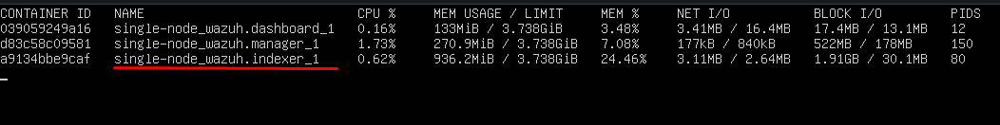
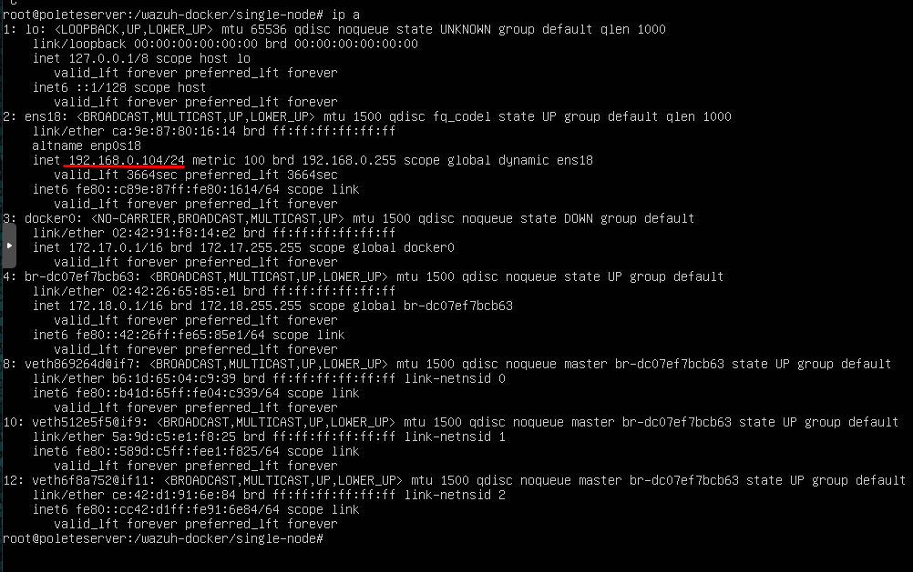
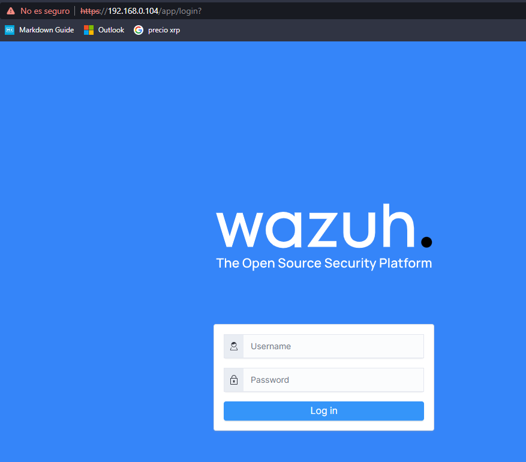
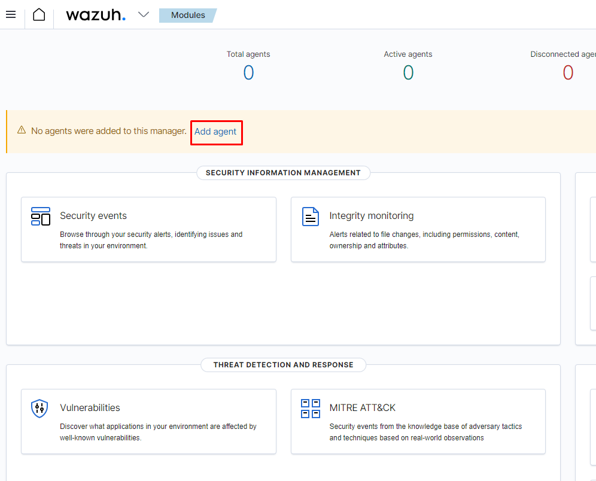
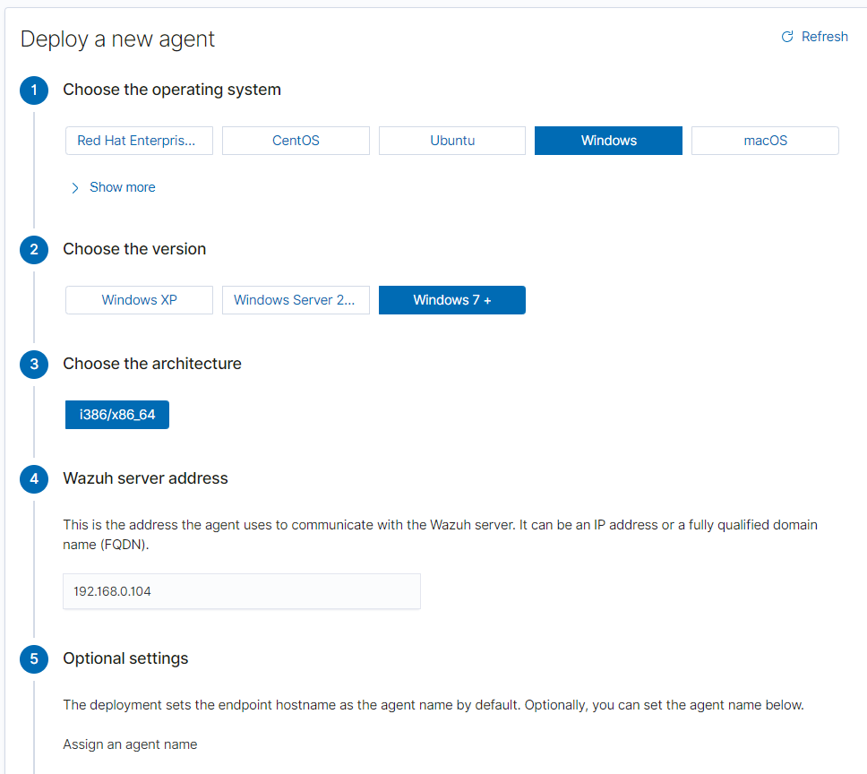
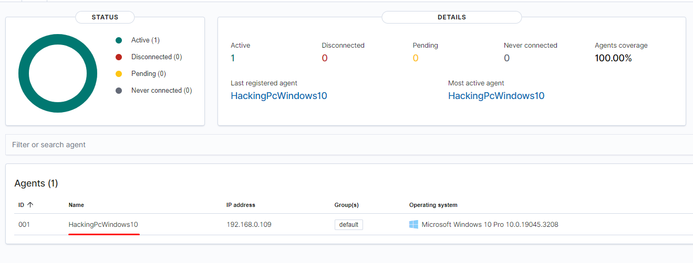
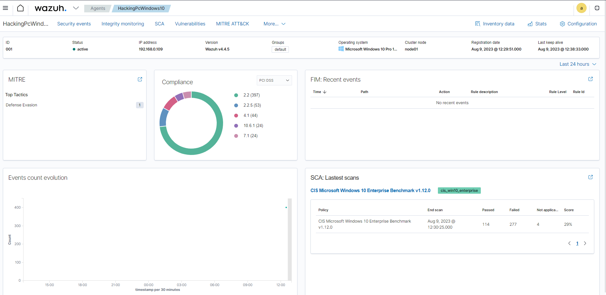
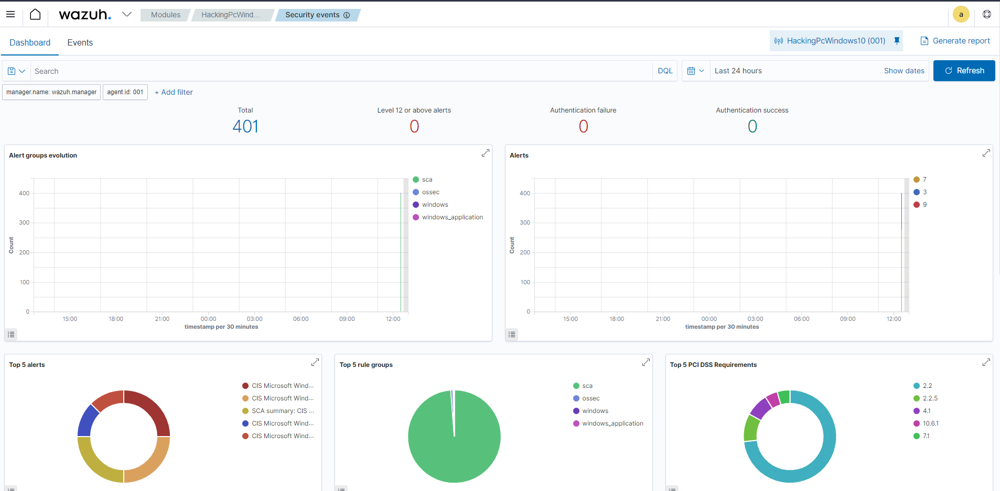

En este proyecto veremos como instalar un SIEM (Security Information Event Management) Open Source para poder administrar los equipos de una red y llevar un control sobre ellos.

# 1. INSTALACIÓN DE WAZUH

En mi caso voy a usar un Ubuntu Server, en el que vamos a instalar Docker para que nuestro proyecto funcione.

Pasos para instalar Docker y Docker-compose:

**sudo apt update**

**sudo apt install docker.io docker-compose -y**

Para comprobar que tenemos docker correctamente instalado en nuestro sistema ejecutamos el siguiente comando:

**docker --version**

Una vez lo tenemos instalado correctamente vamos a clonar un repositorio de Github dónde se encuentra la herramienta Wazuh:

**git clone https://github.com/wazuh/wazuh-docker.git -b v4.4.5**

Una vez tenemos el repositorio clonado veremos que tenemos una carpeta llamada **wazuh-docker**, dentro de ella entramos a otra carpeta llamada **single-node**.

Ahora debemos instalar los certificados correspondientes para que todo funcione, con el comando:

**docker-compose -f generate-indexer-certs.yml run --rm generator**

Es hora de ejcutar nuestro contenedor:

**docker-compose up -d **

La instalación tardará un rato, hay que tener paciencia.

Para ver que la instalación se ha realizado correctamente escribimos:

**docker stats**

# 2. ACCEDIENDO A WAZUH

Ahora vamos a ir a nuestro navegador web y vamos a introducir la dirección IP de nuestra máquina virtual:

Las credenciales por defecto son las siguientes:

- **User:** admin
- **Password:** SecretPassword

El siguiente paso es instalar un agente a un dispositivo que nosotros queramos:

Ahora toca configurar un agente para un dispositivo que nosotros queramos. En mi caso voy a configurar un ordenador Windows:

En mi caso debo hacerlo desde PowerShell con permisos elevados:

Finalmente podemos ver que el agente se ha instalado correctamente y esta funcionando:

Ahora si entramos dentro del equipo el cual le hemos instalado el agente podemos visualizar muchas tareas para tener un mayor control y gestión sobre el equipo:

También podemos ver alertas de seguridad:

Y los más importante de todo es que podemos ver vulnerabilidades y riesgos basados en la matriz de MITTRE ATTACK:

Os he enseñado un poco como funciona la herramienta, es muchísimo mas compleja y se pueden configurar muchos parámetros más. Es cuestión de ir probando e ir instalando agentes. De esta manera los equipos estarán más protegidos ya que tendréis una mayor visibilidad sobre sus vulnerabilidades y riesgos los cuales se pueden mitigar.

